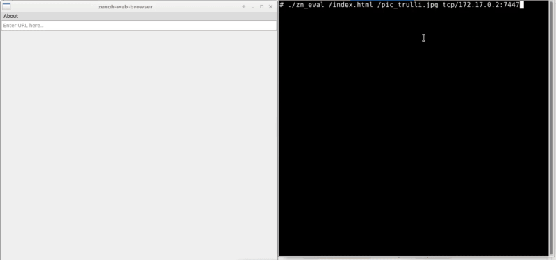

# Zenoh-based Web Browser Proof-of-Concept
Proof-of-concept browsing capabilities supported by Zenoh protocol.

## Demo

## Quick Guide
1. By default *ZN_CONFIG_PEER_KEY* is configured as tcp/127.0.0.1:7447:
     - If needed, changed it in
       [zenoh-handler](src/handlers/zenoh-handler.cpp) implementation.
2. Start the Zenoh router (zenohd).
3. Deploy a Zenoh application that implements eval function the resources.
4. Start Zenoh-based Web Browser

## License
This program is free software: you can redistribute it and/or modify
it under the terms of the GNU General Public License as published by
the Free Software Foundation, either version 3 of the License, or
(at your option) any later version.

This program is distributed in the hope that it will be useful,
but WITHOUT ANY WARRANTY; without even the implied warranty of
MERCHANTABILITY or FITNESS FOR A PARTICULAR PURPOSE.  See the
GNU General Public License for more details.

You should have received a copy of the GNU General Public License
along with this program. If not, see <http://www.gnu.org/licenses/>.
